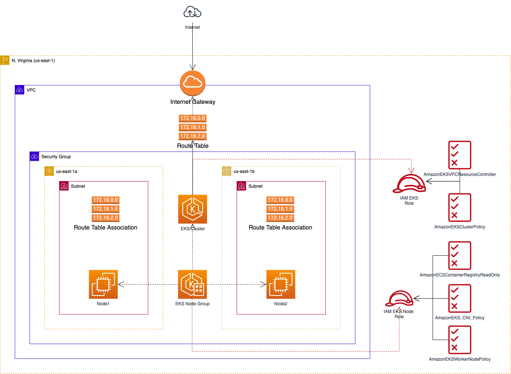

# Elastic Kubernetes Service

Easy moduled way to running up a EKS on AWS.

## Infrastructure Diagram


---

## Deploying and Destroying

```shell
terraform apply --auto-approve

module.network.data.aws_region.current: Reading...
module.network.data.aws_region.current: Read complete after 0s [id=us-east-1]

Terraform used the selected providers to generate the following execution plan. Resource actions are indicated with the following symbols:
  + create

Terraform will perform the following actions:

  # module.eks.aws_eks_cluster.cluster will be created
  # module.eks.aws_eks_node_group.nodes will be created
  # module.eks.aws_iam_role.eks will be created
  # module.eks.aws_iam_role.eks_node will be created
  # module.eks.aws_iam_role_policy_attachment.AmazonEC2ContainerRegistryReadOnly will be created
  # module.eks.aws_iam_role_policy_attachment.AmazonEKSClusterPolicy will be created
  # module.eks.aws_iam_role_policy_attachment.AmazonEKSVPCResourceController will be created
  # module.eks.aws_iam_role_policy_attachment.AmazonEKSWorkerNodePolicy will be created
  # module.eks.aws_iam_role_policy_attachment.AmazonEKS_CNI_Policy will be created
  # module.eks.aws_security_group.cluster-sg will be created
  # module.eks.aws_security_group_rule.cluster-ingress-workstation-https will be created
  # module.network.aws_default_route_table.route will be created
  # module.network.aws_internet_gateway.gw will be created
  # module.network.aws_route_table_association.route-association[0] will be created
  # module.network.aws_route_table_association.route-association[1] will be created
  # module.network.aws_security_group.sg_alb will be created
  # module.network.aws_security_group.sg_default will be created
  # module.network.aws_security_group.sg_efs will be created
  # module.network.aws_security_group.sg_elasticsearch will be created
  # module.network.aws_security_group.sg_rds will be created
  # module.network.aws_security_group.sg_redis will be created
  # module.network.aws_subnet.subnet[0] will be created
  # module.network.aws_subnet.subnet[1] will be created
  # module.network.aws_vpc.vpc will be created

Plan: 24 to add, 0 to change, 0 to destroy.
```

Applying and wait to complete:

```shell
Apply complete! Resources: 24 added, 0 changed, 0 destroyed.
```

To get access to the cluster (aws client required), run:

```shell
$ aws eks --region us-east-1 update-kubeconfig --name development
```

To see the namespaces:

```shell
$ kubectl get ns

NAME              STATUS   AGE
default           Active   31m
kube-node-lease   Active   31m
kube-public       Active   31m
kube-system       Active   31m
```

To destroy everything:

```shell
$ terraform destroy --auto-approve

Plan: 0 to add, 0 to change, 24 to destroy.
...

Destroy complete! Resources: 24 destroyed.
```